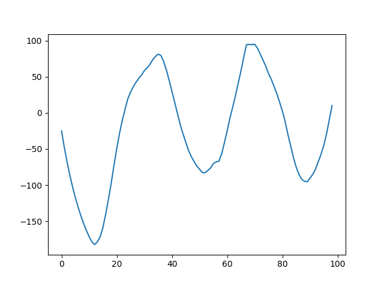

# Paper

[Real-time visual respiration rate estimation with dynamic scene adaptation](https://ieeexplore.ieee.org/document/7789974) - Avishek Chatterjee, A. P. Prathosh, Pragathi Praveena, Vidyadhar Upadhya


This figure shows my respiration rate. The widths of the peaks can be used to measure the rate of respiration and see whether a person has pneumonia (faster breathing in pneumonia) or not.

# Packages
To install the required python3 packages run:
```
pip install -r requirements.txt
```

If getting qt / libjasper / libatlas errors, execute:
```
sudo apt-get install libatlas-base-dev
sudo apt-get install libjasper-dev
sudo apt-get install libqtgui4
sudo apt-get install python3-pyqt5
sudo apt-get install libqt4-test
```

# Instructions
To see the graph in real-time, execte:
```
python src/main.py
```

To save respiration signal to a text file, execte:
```
python src/module.py
```